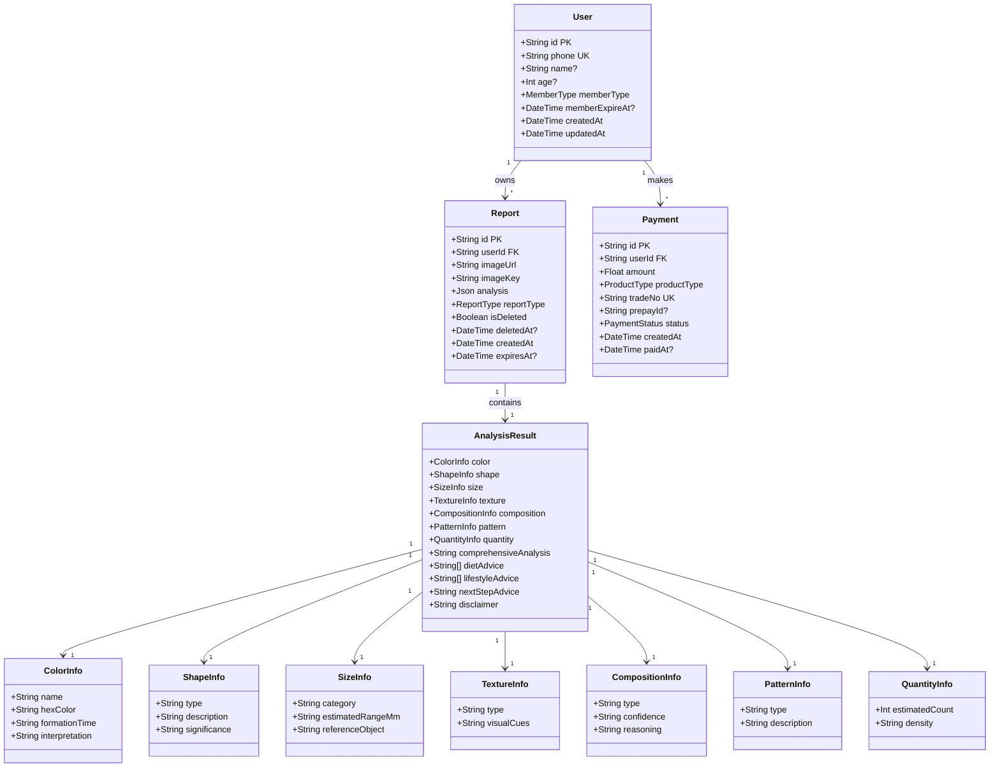
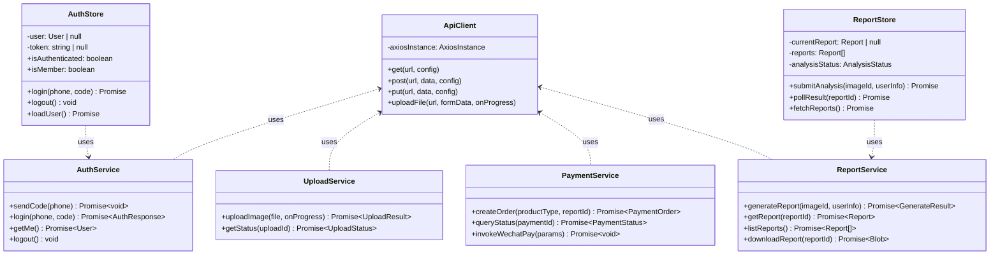
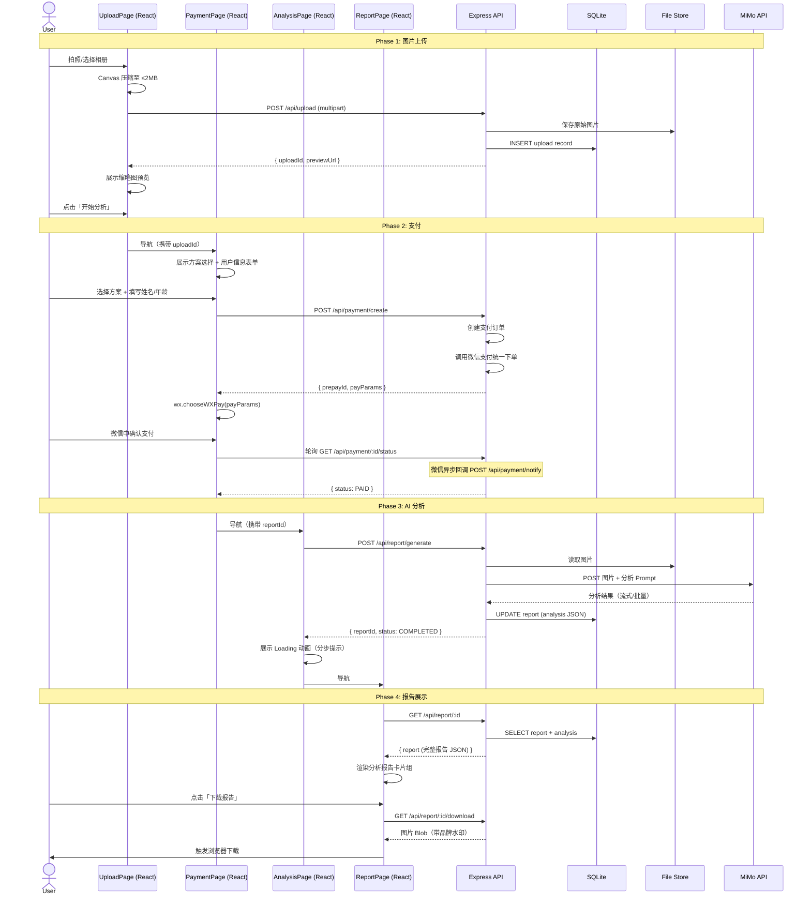
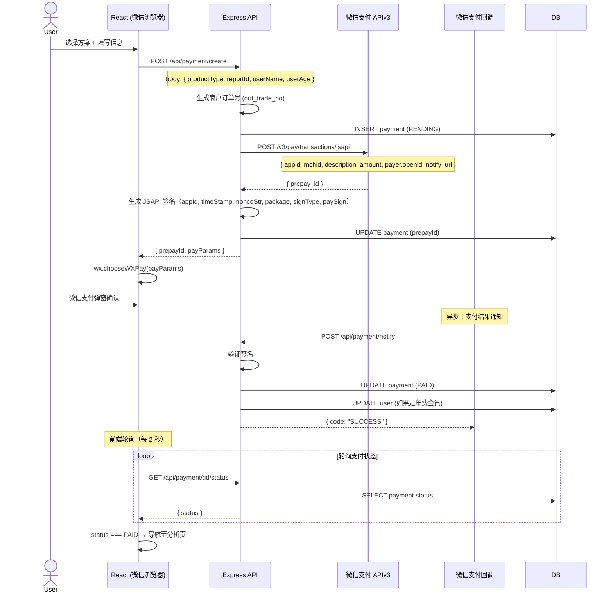
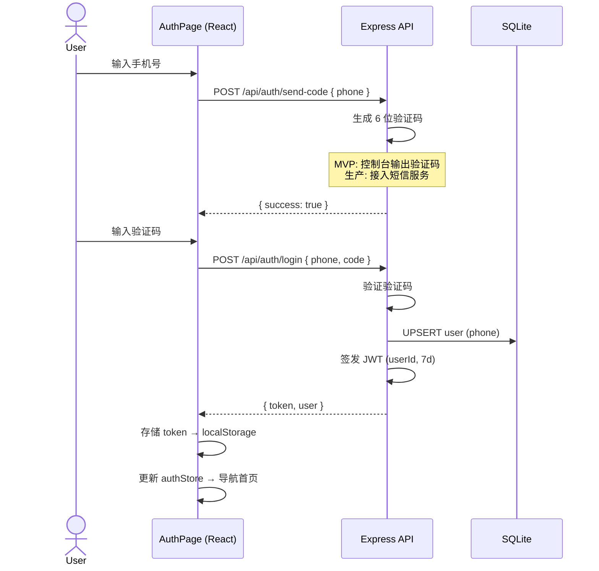
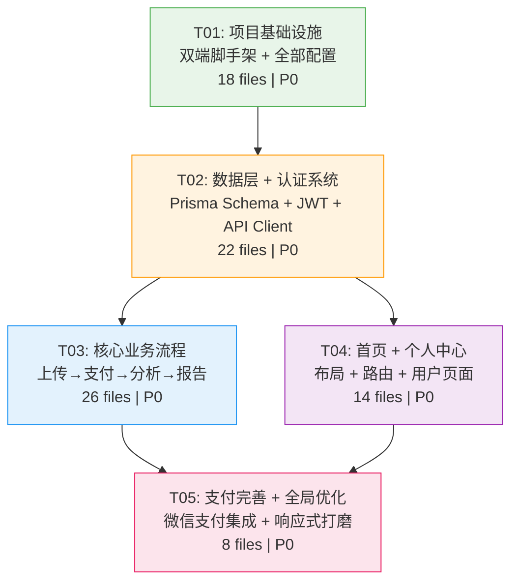

# 「排排看」系统架构设计文档

> 版本：v1.1 | 作者：Bob（架构师） | 日期：2026-06-12
> 基于 PRD v1.0 | MVP 范围：P0（8 个需求），为 P1/P2 预留扩展点
> v1.1 变更：AI 模型从 DeepSeek 切换至 MiMo（mimo-v2.5），Prompt 模板整合肝胆排毒知识库

---

## Part A: 系统设计

### 1. 实现方案

#### 1.1 核心技术挑战

| 挑战 | 分析 | 对策 |
|------|------|------|
| **MiMo 多模态调用** | MiMo-V2.5 支持图片 base64 传入 + 自定义 Prompt，OpenAI 兼容 API，响应时间 5-15s | 采用异步轮询模式：上传图片→提交分析任务→轮询结果；前端展示分步 Loading 动画 |
| **微信支付 JSAPI** | 需在微信内置浏览器中调起支付，涉及签名、回调、订单状态同步 | 后端生成预支付参数，前端 `wx.chooseWXPay` 调起；后端 `/notify` 接收异步回调更新订单 |
| **移动端图片上传** | 拍照/相册图片可能达 10MB，需前端压缩 + 后端存储 | 前端 Canvas 压缩至 ≤ 2MB 后上传；后端 Multer 接收，本地存储（可迁 OSS） |
| **单次付费报告过期** | 7 天软删除 + 30 天缓冲物理删除 | 定时任务（node-cron）每日扫描过期报告，先标记 `isDeleted`，30 天后物理删除文件+记录 |
| **年费会员加密存储** | 需 AES-256 加密图片和报告，密钥与用户绑定 | 每个用户独立密钥（由 `user.id` + 服务端主密钥 HKDF 派生），图片落盘前加密 |

#### 1.2 框架与库选型

| 层次 | 选型 | 版本 | 理由 |
|------|------|------|------|
| **前端框架** | React | ^18.x | 生态成熟，MUI 官方支持，社区资源丰富 |
| **构建工具** | Vite | ^5.x | 极速 HMR，TypeScript 原生支持，产物体积小 |
| **UI 组件库** | MUI (Material UI) | ^5.14.x | 移动端适配好，BottomNavigation 等组件开箱即用 |
| **CSS 方案** | Tailwind CSS | ^3.4.x | 原子化样式，移动端响应式开发效率高 |
| **路由** | React Router | ^6.x | SPA 路由标准方案，支持懒加载 |
| **状态管理** | Zustand | ^4.x | 轻量（< 1KB），API 简洁，适合中小型项目 |
| **HTTP 客户端** | Axios | ^1.x | 拦截器支持 JWT 自动注入，错误统一处理 |
| **后端框架** | Express.js | ^4.x | 简单可靠，中间件生态丰富 |
| **ORM** | Prisma | ^5.x | 类型安全，Schema 即文档，迁移管理方便 |
| **数据库** | SQLite（MVP）→ PostgreSQL | — | MVP 零配置启动；Prisma 切换数据库只需改 datasource |
| **文件上传** | Multer | ^1.x | Express 标准 multipart 解析中间件 |
| **图片压缩** | Sharp | ^0.33.x | Node.js 高性能图片处理，生成缩略图 |
| **加密** | Node.js crypto (内置) | — | AES-256-GCM，零依赖 |
| **JWT** | jsonwebtoken | ^9.x | 标准 JWT 签发与验证 |
| **定时任务** | node-cron | ^3.x | 报告过期清理等周期任务 |
| **支付 SDK** | wechatpay-node-v3 | ^0.x | 微信支付 APIv3 Node.js SDK |

#### 1.3 架构模式

```
┌─────────────────────────────────────────────────────────┐
│                    移动端浏览器（微信/独立）               │
│  ┌──────────────────────────────────────────────────┐  │
│  │            React SPA (Vite + MUI + Tailwind)      │  │
│  │  ┌──────────┐ ┌──────────┐ ┌──────────────────┐  │  │
│  │  │  Pages   │ │Components│ │  Store (Zustand)  │  │  │
│  │  ├──────────┤ ├──────────┤ ├──────────────────┤  │  │
│  │  │ HomePage │ │  Layout  │ │  authStore        │  │  │
│  │  │ UploadPg │ │  Upload  │ │  reportStore      │  │  │
│  │  │ PayPage  │ │  Payment │ └──────────────────┘  │  │
│  │  │ ReportPg │ │  Report  │                       │  │
│  │  │ProfilePg │ │  Profile │  Services (Axios)     │  │
│  │  └──────────┘ └──────────┘  ┌──────────────────┐  │  │
│  │                              │ api / auth / up   │  │  │
│  │  Routes (React Router v6)   │ payment / report  │  │  │
│  │  ┌──────────────────────┐   └──────────────────┘  │  │
│  │  │ Lazy Load + AuthGuard│                         │  │
│  │  └──────────────────────┘                         │  │
│  └──────────────────────────────────────────────────┘  │
└──────────────────────┬──────────────────────────────────┘
                       │ HTTPS (JWT Bearer Token)
                       ▼
┌─────────────────────────────────────────────────────────┐
│                 Express.js API Server                    │
│  ┌─────────────┐ ┌──────────────┐ ┌─────────────────┐  │
│  │  Middleware  │ │   Routes     │ │    Services     │  │
│  │  - auth(JWT) │ │  /api/auth   │ │  - aiService    │  │
│  │  - error     │ │  /api/upload │ │  - paymentSvc   │  │
│  │  - upload    │ │  /api/payment│ │  - reportSvc    │  │
│  │  - validate  │ │  /api/report │ │  - encryptSvc   │  │
│  │              │ │  /api/user   │ │  - storageSvc   │  │
│  └─────────────┘ └──────────────┘ └─────────────────┘  │
│                                                         │
│  ┌─────────────┐ ┌──────────────┐ ┌─────────────────┐  │
│  │  Prisma ORM │ │  File Store  │ │  node-cron      │  │
│  │  (SQLite)   │ │  (Local FS)  │ │  (cleanup job)  │  │
│  └─────────────┘ └──────────────┘ └─────────────────┘  │
└──────────┬──────────────────┬───────────────────────────┘
           │                  │
           ▼                  ▼
     ┌──────────┐     ┌──────────────┐
     │  SQLite  │     │ MiMo API     │
     │  (本地)   │     │ (图片分析)    │
     └──────────┘     └──────────────┘
```

---

### 2. 文件列表

```
pai_pai_kan/
├── index.html                          # Vite 入口 HTML
├── package.json                        # 前端依赖与脚本
├── vite.config.ts                      # Vite 配置（代理、构建）
├── tsconfig.json                       # TypeScript 配置
├── tsconfig.node.json                  # Node 端 TS 配置
├── tailwind.config.ts                  # Tailwind 主题扩展
├── postcss.config.js                   # PostCSS 插件
├── .gitignore
├── .env.example                        # 环境变量模板
│
├── public/
│   └── favicon.svg
│
├── server/                             # 后端服务
│   ├── package.json
│   ├── tsconfig.json
│   ├── .env.example
│   ├── prisma/
│   │   └── schema.prisma               # 数据库 Schema
│   └── src/
│       ├── index.ts                    # 服务入口
│       ├── config.ts                   # 环境变量配置
│       ├── routes/
│       │   ├── auth.ts                 # 登录/注册路由
│       │   ├── upload.ts               # 图片上传路由
│       │   ├── payment.ts              # 支付路由（含回调）
│       │   ├── report.ts               # 报告路由
│       │   └── user.ts                 # 用户信息路由
│       ├── services/
│       │   ├── ai.ts                   # MiMo API 调用
│       │   ├── payment.ts              # 微信支付服务
│       │   ├── report.ts               # 报告生成/管理
│       │   ├── encryption.ts           # AES-256 加密
│       │   └── storage.ts              # 文件存储管理
│       ├── middleware/
│       │   ├── auth.ts                 # JWT 鉴权中间件
│       │   └── errorHandler.ts         # 全局错误处理
│       └── utils/
│           ├── jwt.ts                  # JWT 签发/验证
│           └── crypto.ts               # 密钥派生工具
│
└── src/                                # 前端源码
    ├── main.tsx                        # React 入口
    ├── App.tsx                         # 根组件（路由 + 布局）
    ├── index.css                       # 全局样式 + Tailwind
    ├── vite-env.d.ts                   # Vite 类型声明
    │
    ├── types/                          # TypeScript 类型定义
    │   ├── index.ts                    # 通用类型
    │   ├── user.ts                     # User, MemberType
    │   ├── report.ts                   # Report, Analysis
    │   └── payment.ts                  # Payment, ProductType
    │
    ├── services/                       # API 调用层
    │   ├── api.ts                      # Axios 实例 + 拦截器
    │   ├── auth.ts                     # 登录/注册 API
    │   ├── upload.ts                   # 图片上传 API
    │   ├── payment.ts                  # 支付 API
    │   └── report.ts                   # 报告 API
    │
    ├── store/                          # 状态管理
    │   ├── authStore.ts                # 用户认证状态
    │   └── reportStore.ts              # 报告/分析状态
    │
    ├── hooks/                          # 自定义 Hooks
    │   ├── useAuth.ts                  # 鉴权逻辑 Hook
    │   ├── useUpload.ts                # 上传逻辑 Hook
    │   ├── usePayment.ts               # 支付逻辑 Hook
    │   └── useReport.ts                # 报告逻辑 Hook
    │
    ├── utils/                          # 工具函数
    │   ├── constants.ts                # 常量（价格、过期天数等）
    │   └── helpers.ts                  # 格式化、图片压缩等
    │
    ├── components/                     # 可复用组件
    │   ├── layout/
    │   │   ├── BottomNav.tsx            # 底部 4 Tab 导航栏
    │   │   ├── PageLayout.tsx           # 页面容器
    │   │   └── Header.tsx              # 顶部标题栏
    │   ├── home/
    │   │   ├── HeroSection.tsx          # 首页主视觉 + CTA
    │   │   └── FlowSteps.tsx            # 3 步流程图
    │   ├── upload/
    │   │   ├── CameraCapture.tsx        # 拍照取景框
    │   │   ├── AlbumPicker.tsx          # 相册选择入口
    │   │   ├── ImagePreview.tsx         # 缩略图预览 + 重拍
    │   │   └── ReferenceGuide.tsx       # 瓶盖参照物引导卡片
    │   ├── payment/
    │   │   ├── PlanSelector.tsx         # 付费方案选择卡片
    │   │   ├── UserInfoForm.tsx         # 姓名+年龄表单
    │   │   └── WechatPayButton.tsx      # 微信支付按钮
    │   ├── analysis/
    │   │   └── AnalysisLoading.tsx      # 分析中 Loading 动画
    │   ├── report/
    │   │   ├── ReportCard.tsx           # 报告卡片容器
    │   │   ├── ColorAnalysis.tsx        # 颜色分析卡片
    │   │   ├── ShapeAnalysis.tsx        # 形态分析卡片
    │   │   ├── SizeAnalysis.tsx         # 大小分析卡片
    │   │   ├── CompositionAnalysis.tsx  # 成分分析卡片
    │   │   ├── PatternAnalysis.tsx      # 排出模式卡片
    │   │   ├── ComprehensiveAnalysis.tsx # 综合分析卡片
    │   │   ├── DietAdvice.tsx           # 饮食建议卡片
    │   │   ├── LifestyleAdvice.tsx      # 生活方式建议卡片
    │   │   └── DownloadButton.tsx       # 下载报告按钮
    │   └── profile/
    │       ├── MemberStatus.tsx          # 会员状态卡片
    │       └── ReportTimeline.tsx        # 历史报告时间线
    │
    ├── pages/                          # 页面组件
    │   ├── HomePage.tsx                 # 首页
    │   ├── UploadPage.tsx               # 上传页
    │   ├── PaymentPage.tsx              # 支付页
    │   ├── AnalysisPage.tsx             # 分析中页面
    │   ├── ReportPage.tsx               # 报告展示页
    │   ├── ProfilePage.tsx              # 个人中心
    │   └── AuthPage.tsx                 # 登录/注册页
    │
    └── routes/
        └── index.tsx                    # 路由配置 + 鉴权守卫
```

---

### 3. 数据结构与接口

#### 3.1 数据库模型（Prisma Schema）



#### 3.2 枚举类型

| 枚举 | 值 | 说明 |
|------|-----|------|
| `MemberType` | `FREE`, `ANNUAL` | 普通用户 / 年费会员 |
| `ReportType` | `SINGLE_PAY`, `ANNUAL_MEMBER` | 单次付费报告 / 会员报告 |
| `ProductType` | `SINGLE_ANALYSIS`, `ANNUAL_MEMBER` | 单次 ¥9.9 / 年费 ¥59.9 |
| `PaymentStatus` | `PENDING`, `PAID`, `REFUNDED`, `CLOSED` | 支付状态机 |

#### 3.3 API 接口列表

```
Base URL: /api

┌────────┬──────────────────────────┬─────────────────────┬──────────────┐
│ Method │ Path                     │ 说明                │ 鉴权         │
├────────┼──────────────────────────┼─────────────────────┼──────────────┤
│ POST   │ /auth/send-code          │ 发送短信验证码       │ 否           │
│ POST   │ /auth/login              │ 手机号+验证码登录    │ 否           │
│ GET    │ /auth/me                 │ 获取当前用户信息     │ JWT          │
├────────┼──────────────────────────┼─────────────────────┼──────────────┤
│ POST   │ /upload                  │ 上传图片（multipart）│ JWT          │
│ GET    │ /upload/:id/status       │ 查询上传状态         │ JWT          │
├────────┼──────────────────────────┼─────────────────────┼──────────────┤
│ POST   │ /payment/create          │ 创建支付订单         │ JWT          │
│ POST   │ /payment/notify          │ 微信支付异步回调     │ 签名验证     │
│ GET    │ /payment/:id/status      │ 查询支付状态         │ JWT          │
├────────┼──────────────────────────┼─────────────────────┼──────────────┤
│ POST   │ /report/generate         │ 提交 AI 分析任务     │ JWT          │
│ GET    │ /report/:id              │ 获取报告详情         │ JWT          │
│ GET    │ /reports                  │ 获取用户报告列表     │ JWT          │
│ GET    │ /report/:id/download     │ 下载报告图片         │ JWT          │
├────────┼──────────────────────────┼─────────────────────┼──────────────┤
│ GET    │ /user/profile            │ 获取个人信息         │ JWT          │
│ PUT    │ /user/profile            │ 更新个人信息         │ JWT          │
│ GET    │ /user/membership         │ 查询会员状态         │ JWT          │
└────────┴──────────────────────────┴─────────────────────┴──────────────┘
```

#### 3.4 前端服务类结构



---

### 4. 程序调用流程

#### 4.1 图片上传 → AI 分析 → 报告生成（核心主流程）



#### 4.2 支付流程（微信支付 JSAPI 详细）



#### 4.3 认证流程



---

### 5. 待明确事项（架构层面）

| # | 事项 | 影响 | 建议 |
|---|------|------|------|
| A1 | **MiMo API 技术验证**：已验证 `mimo-v2.5` 支持图片 base64 传入 + 自定义 Prompt，OpenAI 兼容 API，响应时间 5-15s | AI Service 实现方式 | ✅ 已完成验证，直接使用 |
| A2 | **微信支付商户号申请**：是否已有微信支付商户号？JSAPI 支付是否需要额外签约？ | 支付集成时间线 | 尽早启动商户号申请流程（通常 1-2 周） |
| A3 | **短信服务商选择**：MVP 短信验证码走哪家（阿里云短信/腾讯云短信/其他）？ | 注册登录实现 | MVP 可先用控制台输出验证码过渡 |
| A4 | **ICP 备案准备**：域名是否已购买？服务器是否已采购？ | 部署上线时间 | 提前准备备案材料，备案周期通常 20 个工作日 |
| A5 | **MiMo API 配额**：调用频率限制是多少？是否需要预充值？ | AI 分析可用性 | 确认配额，必要时申请提额 |
| A6 | **OSS 迁移时机**：MVP 本地存储能支撑多久？何时迁至阿里云 OSS / 腾讯云 COS？ | 存储架构扩展 | 建议 P1 阶段迁移，本地存储仅用于 MVP 种子用户阶段 |

---

## Part B: 任务分解

### 6. 依赖包列表

#### 6.1 前端（package.json）

```
- react@^18.2.0: UI 框架
- react-dom@^18.2.0: React DOM 渲染
- react-router-dom@^6.20.0: SPA 路由
- @mui/material@^5.14.0: Material UI 组件库
- @mui/icons-material@^5.14.0: MUI 图标集
- @emotion/react@^11.11.0: MUI 样式引擎
- @emotion/styled@^11.11.0: MUI styled API
- zustand@^4.4.0: 轻量状态管理
- axios@^1.6.0: HTTP 客户端
- react-hook-form@^7.48.0: 表单管理
- html2canvas@^1.4.1: 报告截图下载
- file-saver@^2.0.5: 浏览器端文件保存
- @fontsource/roboto@^5.0.0: 字体
```

#### 6.2 开发依赖（前端）

```
- vite@^5.0.0: 构建工具
- @vitejs/plugin-react@^4.2.0: Vite React 插件
- typescript@^5.3.0: TypeScript 编译器
- tailwindcss@^3.4.0: 原子化 CSS
- postcss@^8.4.0: CSS 后处理
- autoprefixer@^10.4.0: CSS 自动前缀
- @types/react@^18.2.0: React 类型
- @types/react-dom@^18.2.0: ReactDOM 类型
- @types/file-saver@^2.0.7: FileSaver 类型
- eslint@^8.55.0: 代码规范
```

#### 6.3 后端（server/package.json）

```
- express@^4.18.0: Web 框架
- prisma@^5.7.0: ORM
- @prisma/client@^5.7.0: Prisma 客户端
- multer@^1.4.5-lts.1: 文件上传中间件
- sharp@^0.33.0: 图片处理（压缩/缩略图/水印）
- jsonwebtoken@^9.0.0: JWT 签发验证
- node-cron@^3.0.3: 定时任务
- cors@^2.8.5: 跨域中间件
- helmet@^7.1.0: 安全头中间件
- dotenv@^16.3.0: 环境变量加载
- uuid@^9.0.0: UUID 生成
```

#### 6.4 开发依赖（后端）

```
- typescript@^5.3.0: TypeScript
- ts-node@^10.9.0: TS 运行时
- tsx@^4.6.0: TS 执行器
- @types/express@^4.17.0: Express 类型
- @types/multer@^1.4.0: Multer 类型
- @types/jsonwebtoken@^9.0.0: JWT 类型
- @types/node-cron@^3.0.0: node-cron 类型
- @types/cors@^2.8.0: CORS 类型
- @types/uuid@^9.0.0: UUID 类型
- nodemon@^3.0.0: 热重载
- prisma@^5.7.0: Prisma CLI
```

---

### 7. 任务列表（按实现顺序）

#### T01: 项目基础设施搭建

| 属性 | 内容 |
|------|------|
| **Task ID** | T01 |
| **Task Name** | 项目基础设施搭建（双端脚手架 + 全部配置） |
| **优先级** | P0 |
| **预估复杂度** | 中 |
| **依赖** | 无 |

**目标文件（18 个）**：

| 类别 | 文件 |
|------|------|
| 根配置 | `package.json`, `.gitignore`, `.env.example` |
| 构建配置 | `vite.config.ts`, `tsconfig.json`, `tsconfig.node.json`, `tailwind.config.ts`, `postcss.config.js` |
| 入口文件 | `index.html`, `public/favicon.svg` |
| 前端入口 | `src/main.tsx`, `src/App.tsx`, `src/index.css`, `src/vite-env.d.ts` |
| 后端配置 | `server/package.json`, `server/tsconfig.json`, `server/.env.example` |
| 后端入口 | `server/src/index.ts`, `server/src/config.ts` |

**验收标准**：
- `npm run dev` 启动前端开发服务器，浏览器看到 React 页面
- `npm run dev`（server 目录）启动后端 Express 服务，`GET /api/health` 返回 `{ status: "ok" }`
- Tailwind + MUI 样式正常生效
- 前端开发代理正确转发 `/api` 请求到后端

---

#### T02: 数据层 + 认证系统

| 属性 | 内容 |
|------|------|
| **Task ID** | T02 |
| **Task Name** | 数据层与认证系统 |
| **优先级** | P0 |
| **预估复杂度** | 高 |
| **依赖** | T01 |

**目标文件（22 个）**：

| 类别 | 文件 |
|------|------|
| 数据库 | `server/prisma/schema.prisma` |
| 后端中间件 | `server/src/middleware/auth.ts`, `server/src/middleware/errorHandler.ts` |
| 后端工具 | `server/src/utils/jwt.ts`, `server/src/utils/crypto.ts` |
| 后端路由 | `server/src/routes/auth.ts`, `server/src/routes/user.ts` |
| 后端服务 | `server/src/services/encryption.ts` |
| 前端类型 | `src/types/index.ts`, `src/types/user.ts`, `src/types/report.ts`, `src/types/payment.ts` |
| 前端服务 | `src/services/api.ts`, `src/services/auth.ts`, `src/services/report.ts` |
| 状态管理 | `src/store/authStore.ts`, `src/store/reportStore.ts` |
| Hooks | `src/hooks/useAuth.ts`, `src/hooks/useReport.ts` |
| 工具 | `src/utils/constants.ts`, `src/utils/helpers.ts` |

**验收标准**：
- `npx prisma migrate dev` 成功创建数据库表
- `POST /api/auth/send-code` → `POST /api/auth/login` 返回 JWT
- JWT 鉴权中间件正确拦截未认证请求
- 前端 Axios 拦截器自动注入 Token、处理 401
- authStore 正确管理登录/登出状态

---

#### T03: 核心业务流程（上传 → 支付 → 分析 → 报告）

| 属性 | 内容 |
|------|------|
| **Task ID** | T03 |
| **Task Name** | 核心业务流程实现 |
| **优先级** | P0 |
| **预估复杂度** | 高 |
| **依赖** | T02 |

**目标文件（26 个）**：

| 类别 | 文件 |
|------|------|
| 后端路由 | `server/src/routes/upload.ts`, `server/src/routes/payment.ts`, `server/src/routes/report.ts` |
| 后端服务 | `server/src/services/ai.ts`, `server/src/services/payment.ts`, `server/src/services/report.ts`, `server/src/services/storage.ts` |
| 前端上传组件 | `src/components/upload/CameraCapture.tsx`, `src/components/upload/AlbumPicker.tsx`, `src/components/upload/ImagePreview.tsx`, `src/components/upload/ReferenceGuide.tsx` |
| 前端支付组件 | `src/components/payment/PlanSelector.tsx`, `src/components/payment/UserInfoForm.tsx`, `src/components/payment/WechatPayButton.tsx` |
| 前端分析组件 | `src/components/analysis/AnalysisLoading.tsx` |
| 前端报告组件 | `src/components/report/ReportCard.tsx`, `src/components/report/ColorAnalysis.tsx`, `src/components/report/ShapeAnalysis.tsx`, `src/components/report/SizeAnalysis.tsx`, `src/components/report/CompositionAnalysis.tsx`, `src/components/report/PatternAnalysis.tsx`, `src/components/report/ComprehensiveAnalysis.tsx`, `src/components/report/DietAdvice.tsx`, `src/components/report/LifestyleAdvice.tsx`, `src/components/report/DownloadButton.tsx` |
| 前端页面 | `src/pages/UploadPage.tsx`, `src/pages/PaymentPage.tsx`, `src/pages/AnalysisPage.tsx`, `src/pages/ReportPage.tsx` |
| Hooks | `src/hooks/useUpload.ts`, `src/hooks/usePayment.ts` |
| 前端服务 | `src/services/upload.ts`, `src/services/payment.ts` |

**验收标准**：
- 拍照/相册选取 → Canvas 压缩 → 上传服务器 → 返回预览 URL
- 方案选择 + 表单填写 → 创建支付订单 → 调起微信支付（测试环境可模拟）
- 支付成功后自动进入分析页 → 调 MiMo API → 返回分析 JSON
- 报告页正确展示分析卡片组（颜色/形态/大小/成分/模式/综合分析/饮食建议/生活方式建议）
- 下载按钮生成带水印报告图片并触发浏览器下载

---

#### T04: 首页 + 个人中心

| 属性 | 内容 |
|------|------|
| **Task ID** | T04 |
| **Task Name** | 首页与个人中心 |
| **优先级** | P0 |
| **预估复杂度** | 中 |
| **依赖** | T02 |

**目标文件（13 个）**：

| 类别 | 文件 |
|------|------|
| 首页组件 | `src/components/home/HeroSection.tsx`, `src/components/home/FlowSteps.tsx` |
| 个人中心组件 | `src/components/profile/MemberStatus.tsx`, `src/components/profile/ReportTimeline.tsx` |
| 页面 | `src/pages/HomePage.tsx`, `src/pages/ProfilePage.tsx`, `src/pages/AuthPage.tsx` |
| 布局组件 | `src/components/layout/BottomNav.tsx`, `src/components/layout/PageLayout.tsx`, `src/components/layout/Header.tsx` |
| 路由 | `src/routes/index.tsx` |
| 定时任务 | （后端）报告过期清理逻辑（内置于 `server/src/index.ts` 或独立文件） |

**验收标准**：
- 首页 Hero + CTA 按钮 + 3 步流程图渲染正确
- 登录/注册页手机号验证码流程完整
- 个人中心正确显示会员状态（普通/年费 + 到期日）
- 历史报告时间线正确展示，单次付费报告显示"剩余 X 天"
- 底部 4 Tab 导航正常工作
- 鉴权守卫：未登录用户只能访问首页和登录页

---

#### T05: 支付集成完善 + 全局优化

| 属性 | 内容 |
|------|------|
| **Task ID** | T05 |
| **Task Name** | 支付集成完善与全局优化 |
| **优先级** | P0 |
| **预估复杂度** | 中 |
| **依赖** | T03, T04 |

**目标文件（8 个）**：

| 类别 | 文件 |
|------|------|
| 后端支付 | `server/src/services/payment.ts`（微信支付回调验证 + 订单状态机完善） |
| 前端支付 | `src/components/payment/WechatPayButton.tsx`（JSAPI 集成 + 轮询 + 错误处理） |
| 路由完善 | `src/routes/index.tsx`（懒加载 + 过渡动画 + 404 页面） |
| 全局样式 | `src/index.css`（移动端响应式打磨 + 底部安全区适配） |
| 错误处理 | （后端 `errorHandler.ts` 完善 + 前端全局 ErrorBoundary） |
| 定时清理 | （后端 node-cron 报告过期清理任务） |

**验收标准**：
- 微信支付 JSAPI 完整调通（需微信环境测试）
- 支付回调正确更新订单状态和用户会员状态
- 报告过期自动清理任务正常运行
- 移动端 375px-428px 完美呈现，平板 768px 适配
- 全局 Loading / Error / Empty 状态覆盖
- 微信浏览器底部安全区（safe-area-inset-bottom）适配

---

### 8. 共享知识

#### 8.1 API 响应规范

```typescript
// 成功响应
{ code: 0, data: T, message: "ok" }

// 业务错误
{ code: number, message: string }
// 错误码区间：
//   1xxx: 认证错误 (1001=未登录, 1002=Token过期, 1003=验证码错误)
//   2xxx: 参数错误 (2001=参数缺失, 2002=参数格式错误)
//   3xxx: 业务错误 (3001=余额不足, 3002=报告不存在, 3003=报告已过期)
//   4xxx: 支付错误 (4001=订单不存在, 4002=支付失败, 4003=签名验证失败)
//   5xxx: 服务错误 (5001=AI分析失败, 5002=文件上传失败)
```

#### 8.2 路由命名规范

```
前端路由（React Router）：
  /                  → HomePage
  /upload            → UploadPage（需登录）
  /payment           → PaymentPage（需登录 + uploadId）
  /analysis/:id      → AnalysisPage（需登录）
  /report/:id        → ReportPage（需登录）
  /profile           → ProfilePage（需登录）
  /login             → AuthPage

后端路由（Express）：
  /api/auth/*        → 认证相关
  /api/upload/*      → 上传相关
  /api/payment/*     → 支付相关
  /api/report/*      → 报告相关
  /api/user/*        → 用户相关
  /api/health        → 健康检查
```

#### 8.3 存储约定

```
- 图片存储路径: server/uploads/{yyyy-MM}/{userId}/{uuid}.{ext}
- 加密图片: 原图 → AES-256-GCM 加密 → uploads/encrypted/{uuid}.enc
- 报告图片下载: 前端 html2canvas 截图 → 后端合成水印 → 返回 PNG
- 缓存: MVP 阶段不做 Redis，Zustand + localStorage 足够
```

#### 8.4 鉴权约定

```
- JWT Payload: { userId: string, iat: number, exp: number }
- Token 有效期: 7 天
- 传输方式: Authorization: Bearer <token>
- 前端存储: localStorage (MVP)
- 微信支付回调: 使用微信 APIv3 签名验证，不走 JWT
```

#### 8.5 设计规范

```
- 主色调: #4CAF50 (Green 500)
- 辅助色: #FFC107 (Amber 500)
- 卡片圆角: 12px
- 卡片阴影: 0 2px 12px rgba(0,0,0,0.08)
- 移动端基准宽度: 375px (设计稿), 适配至 428px
- 平板断点: 768px
- 标题字号: 20px bold
- 正文字号: 15px
- 辅助文字: 12px
- 底部导航高度: 56px + env(safe-area-inset-bottom)
```

#### 8.6 MiMo AI Prompt 模板

##### 8.6.1 分析 Prompt（核心）

```
你是一位资深的肝胆排毒分析专家，基于《神奇的肝胆排石法》（Andreas Moritz 著）及中医肝胆理论，对用户拍摄的肝胆排毒排出物照片进行专业分析。

## 颜色分类参考体系

| 颜色 | 形成时间 | 健康意义 |
|------|---------|---------|
| 鲜绿色 | 近几周至几个月 | 近期形成的胆固醇结石，表面覆盖新鲜胆汁，属较新的排出物 |
| 翠绿色 | 几个月至一年 | 典型的胆固醇性结石，最常见类型，数量通常最多 |
| 墨绿色 | 一年以上 | 较为陈旧的结石，胆汁色素已氧化，形成时间较长 |
| 深绿至黑绿色 | 数年 | 非常陈旧的结石，高度氧化，质地较硬 |
| 黄褐色 | 不定 | 胆固醇含量极高的结石 |
| 米黄色/乳白色 | 较长时间 | 以胆固醇为主的纯胆固醇性结石，属陈年结石，质地较软或蜡状 |
| 土黄色 | 不定 | 混合型结石，含胆固醇和胆红素 |
| 棕褐色 | 较长时间 | 含胆红素较多的色素性结石，常与胆汁淤积相关 |
| 暗红色/红褐色 | 不定 | 含血液成分的结石，提示可能有微小的胆道出血 |
| 白色/灰白色 | 长期 | 高度钙化的结石或纯胆固醇核心，最陈旧的结石 |
| 黑色 | 长期 | 胆红素钙结石，质地坚硬，常见于肝内胆管 |

## 形态分类参考体系

| 形态 | 描述 | 代表意义 |
|------|------|---------|
| 豌豆状圆形 | 表面光滑，圆形或椭圆形 | 典型的胆囊胆固醇结石，长期在胆汁中滚动形成 |
| 桑葚状/菜花状 | 表面凹凸不平，多面体或多瓣状 | 多个小结晶聚集而成 |
| 米粒状 | 细小颗粒状 | 早期形成的胆固醇结晶，数量通常很多 |
| 碎片状 | 不规则形状，边缘锐利 | 较大结石在排出过程中破碎形成 |
| 管状/圆柱状 | 细长圆柱形，两端圆钝 | 肝内胆管的铸型结石，说明曾有胆管堵塞 |
| 树枝状 | 分叉状，形似树枝 | 胆管分支的铸型，说明结石范围广泛 |
| 片状/薄片状 | 扁平薄片 | 胆管壁上的沉积物脱落形成 |
| 泥沙状 | 极细小的颗粒 | 尚未凝结的胆固醇结晶，早期结石状态 |
| 絮状/棉絮状 | 松软蓬松 | 胆汁中的胆固醇絮状凝集物 |
| 泥状/糊状 | 无固定形状，糊状 | 软性结石团块，形成初期阶段 |
| 结晶状 | 闪光的晶体颗粒 | 纯净的胆固醇结晶 |

## 大小分类参考体系

| 分类 | 直径范围 |
|------|---------|
| 微细型 | <1mm |
| 细沙型 | 1-2mm |
| 米粒型 | 2-4mm |
| 豌豆型 | 4-7mm |
| 黄豆型 | 7-10mm |
| 花生型 | 10-15mm |
| 蚕豆型 | >15mm |

## 质地分类参考体系

| 质地 | 手感特征 | 成分构成 |
|------|---------|---------|
| 软质 | 柔软有弹性，按压即碎 | 以胆固醇为主，水分含量高 |
| 蜡质 | 有韧性，不易捏碎 | 胆固醇高度浓缩，含少量钙 |
| 硬质 | 硬实，捏压有阻力 | 含较多钙质和胆红素 |
| 脆质 | 轻压即碎裂 | 胆固醇结晶含量高，结构松散 |
| 油质 | 滑腻，手指有油光 | 纯胆固醇结晶，尚未硬化 |
| 海绵质 | 轻软，浮力大，内部多孔 | 胆汁泡沫凝结而成 |
| 泥浆质 | 有流动感 | 胆汁中的胆固醇微结晶 |

## 成分分类参考

1. **胆固醇性结石**（最常见，80-90%）：胆固醇结晶>70%，黄绿色至墨绿色，浮于水面
2. **胆红素性结石**（5-10%）：胆红素钙，棕褐色至黑色，可能下沉或悬浮
3. **混合性结石**（5-15%）：胆固醇+胆红素+钙盐，土黄色至棕褐色
4. **胆汁结晶微团**：胆固醇微结晶+胆汁酸，泥沙状/絮状
5. **胆管铸型**：胆固醇+胆汁色素+黏液，管状或树枝状，墨绿色
6. **钙化性结石核心**：碳酸钙+磷酸钙，白色或灰白色
7. **黏液管型**：胆汁黏液+少量胆固醇，半透明或浅绿色条状物

## 排出模式健康解读

- **模式一**：大量鲜绿色碎石 → 肝胆系统中近期形成了大量胆固醇结晶
- **模式二**：大量墨绿色管状铸型 → 肝内胆管被严重堵塞，铸型表明胆管已清理
- **模式三**：白色核心+绿色外壳 → 陈年的胆固醇核心+近期包裹的胆汁层
- **模式四**：大量泥沙状物 → 结石处于早期结晶阶段
- **模式五**：混合颜色和形态 → 结石形成于不同时期，分布广泛
- **模式六**：几乎无排出物 → 准备不足或肝胆系统相对干净

## 真假鉴别要点

| 鉴别点 | 真正的胆结石 | 皂化物/食物反应物 |
|--------|------------|----------------|
| 浮水试验 | 浮于水面 | 可能下沉 |
| 室温放置 | 变硬不腐烂 | 可能变软腐烂 |
| 水中保存 | 数周不溶解 | 可能溶解或发霉 |
| 气味 | 无明显异味或轻微蜡味 | 油脂酸败味 |
| 颜色 | 均匀一致 | 颜色不均 |

---

请分析这张图片中的肝胆排毒排出物，严格按以下 JSON 格式输出（只返回 JSON，不要其他文字）：

{
  "color": {
    "name": "颜色名称（如：鲜绿色、翠绿色、墨绿色、黄褐色、棕褐色、白色、黑色等，参照颜色分类体系）",
    "hexColor": "#XXXXXX",
    "formationTime": "形成时间段（如：近几周、几个月、一年以上、数年）",
    "interpretation": "基于颜色的健康解读（结合颜色分类参考体系，说明结石新旧程度和成分特征）"
  },
  "shape": {
    "type": "形态类型（如：圆形、桑葚状、米粒状、管状、树枝状、泥沙状、絮状等，参照形态分类体系）",
    "description": "形态特征详细描述",
    "significance": "形态代表的健康意义（如：管状=胆管铸型，圆形=胆囊结石等）"
  },
  "size": {
    "category": "大小分类（微细型/细沙型/米粒型/豌豆型/黄豆型/花生型/蚕豆型）",
    "estimatedRangeMm": "估算尺寸范围（如：2-4mm）",
    "referenceObject": "参照物对比（如有瓶盖则用瓶盖估算，否则说明无参照物）"
  },
  "texture": {
    "type": "质地类型（软质/蜡质/硬质/脆质/油质/海绵质/泥浆质）",
    "visualCues": "从图片中可判断的质地线索"
  },
  "composition": {
    "type": "成分类型（胆固醇性/胆红素性/混合性/胆汁结晶微团/胆管铸型/钙化性/黏液管型）",
    "confidence": "判断置信度（高/中/低）",
    "reasoning": "判断依据"
  },
  "pattern": {
    "type": "排出模式（模式一至模式六）",
    "description": "模式说明"
  },
  "quantity": {
    "estimatedCount": "估计数量",
    "density": "密度描述（稀疏/适中/密集）"
  },
  "comprehensiveAnalysis": "综合分析解读（结合颜色、形态、大小、质地、成分多维度，给出专业的健康评估，使用'基于肝胆排毒理论'表述，不直接引用书籍原文）",
  "dietAdvice": [
    "饮食建议1（具体可执行的建议）",
    "饮食建议2",
    "饮食建议3",
    "饮食建议4",
    "饮食建议5"
  ],
  "lifestyleAdvice": [
    "生活方式建议1",
    "生活方式建议2",
    "生活方式建议3"
  ],
  "nextStepAdvice": "下一步建议（如：建议间隔2-4周后进行下一次排石、建议先做肠道清洁等）",
  "disclaimer": "健康提示（如：本分析仅供参考，不构成医疗建议，如有严重症状请咨询医生）"
}
```

##### 8.6.2 瓶盖参照物 Prompt 补充

```
{if hasCap}
图片中包含瓶盖参照物（颜色：{capColor}，直径约 30mm），请据此进行：
1. 色彩校准：以瓶盖颜色为基准调整排出物颜色判断
2. 尺寸估算：以瓶盖直径为标尺，精确估算排出物的大小
3. 距离判断：根据瓶盖与排出物的相对大小判断拍摄距离
{else}
注意：图片中未发现瓶盖参照物，请仅做定性分析，并提醒用户：
1. 建议在下次拍摄时放置瓶盖作为参照物
2. 当前尺寸估算为粗略估计，添加参照物后可获得更精准的数据
{/if}
```

##### 8.6.3 饮食建议知识库（Prompt 注入）

```
## 肝胆排毒饮食建议知识库

### 排石期间饮食
- 排石前6天：每日1000ml新鲜苹果汁，分4-5次饮用，下午5点前喝完
- 饮食原则：清淡素食，以蔬菜、水果、全谷物、豆类为主
- 严格禁止：肉类、鱼类、蛋类、乳制品、油炸食品、酒精、咖啡、碳酸饮料、冷饮
- 温热饮食：避免生冷，所有食物温热食用

### 日常护肝饮食
- 推荐食物：十字花科蔬菜（西兰花、卷心菜）、大蒜、姜黄、甜菜根、柠檬、绿茶、全谷物
- 护肝营养素：维生素A、E、C、B族维生素、谷胱甘肽、水飞蓟素
- 每日饮水：2000-3000ml温水，晨起300-500ml柠檬水

### 排毒果汁配方
- 绿色排毒汁：芹菜+黄瓜+青苹果+生姜+菠菜
- 红色护肝汁：甜菜根+胡萝卜+苹果+柠檬
- 黄色清热汁：胡萝卜+姜黄+橙子+柠檬
- 综合排毒汁：苦瓜+黄瓜+芹菜+苹果+柠檬

### 禁忌食物清单
蛋黄、动物内脏、虾蟹、肥肉、油炸食品、奶茶、奶油、辣椒、咖啡、浓茶、酒精、冰淇淋、冷饮
```

##### 8.6.4 健康解读知识库（Prompt 注入）

```
## 肝胆排毒健康解读知识库

### 肝胆问题常见症状（70+项）
消化系统：腹胀、反酸、嗳气、恶心、便秘、腹泻、食欲不振
代谢系统：高血脂、脂肪肝、血糖异常、肥胖
免疫系统：过敏性鼻炎、哮喘、荨麻疹、湿疹、类风湿
神经系统：慢性疲劳、偏头痛、失眠、记忆力下降
皮肤问题：痤疮、暗沉、黄褐斑、瘙痒、牛皮癣
其他：右肩颈僵硬、口苦、眼干、经前综合征、情绪波动

### 肝胆排毒 healing pathway
排石→胆汁流通→肝脏解毒改善→血液毒素下降→全身炎症减轻→系统功能改善→慢性病症状减轻

### 排石后短期效果（1-3天）
身体轻盈感、皮肤改善、消化改善、颈肩放松、精力提升、情绪稳定

### 排石后中期效果（1-2周）
过敏缓解、睡眠改善、眼睛清澈、舌苔变薄、经前不适减轻、右肩背痛消失

### 排石后长期效果（多次排石后）
脂肪肝改善、血脂/血糖正常化、免疫力增强、慢性疼痛减少

### 中医时辰养生
子时（23:00-01:00）：胆经当令，胆汁分泌排泄最活跃
丑时（01:00-03:00）：肝经当令，肝脏解毒修复最活跃
建议：晚上11点前入睡，保证肝胆修复时间

### 安全警示
禁忌人群：孕妇、严重心肝肾疾病、胆结石>0.8cm、急性胆囊炎/胰腺炎
排石间隔：2-4周，需3-4次排石，之后季度/半年维护
```

---

### 9. 任务依赖图



---

### 附录：P1/P2 架构扩展点

| 扩展点 | 预留设计 | 触发需求 |
|--------|----------|----------|
| **瓶盖参照物识别** | `ReferenceGuide` 组件已预留 AI 分析 Prompt 中的 `{if hasCap}` 分支 | P1-1 |
| **报告对比** | `reportStore` 已设计 reports 列表，预留 `ComparePage` + `CompareView` 组件 | P1-2 |
| **报告过期清理** | `server/src/index.ts` 中 node-cron 定时任务框架已就绪 | P1-3 |
| **加密存储** | `encryption.ts` 已实现 AES-256-GCM + HKDF 密钥派生，年费会员图片写入加密路径 | P1-4 |
| **上传引导** | `ReferenceGuide.tsx` 组件已包含瓶盖示意图展示能力 | P1-5 |
| **个性化饮食建议** | AI Prompt 中 `dietAdvice` 字段已支持差异化，仅需细化 Prompt | P2-1 |
| **分享卡片** | 报告截图（html2canvas）能力已实现，加二维码/品牌元素即可 | P2-2 |
| **后台管理** | 独立管理端 SPA + `/api/admin/*` 路由，不影响主业务 | P2-3 |
| **OSS 迁移** | `storage.ts` 抽象了 `save()` / `read()`，只需实现 OSS 适配器 | — |
| **数据库迁移** | Prisma datasource 改一行即可从 SQLite 切换至 PostgreSQL/MySQL | — |
